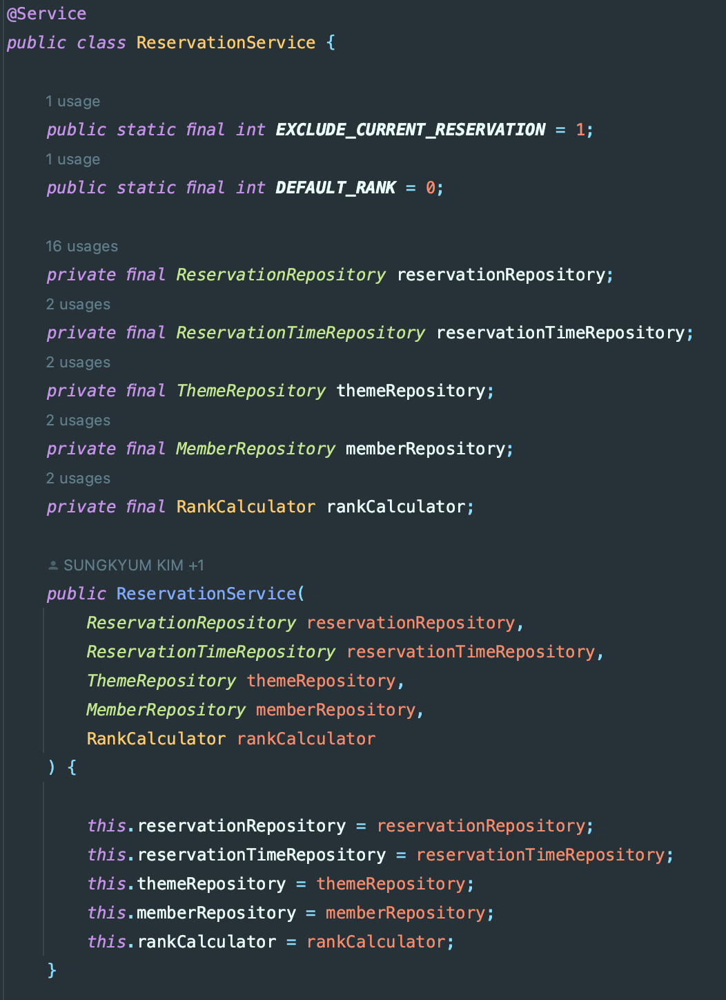

# 2024-06-01 

## Service Layer 에 대한 고찰과 Facade Pattern


요구사항이 늘어가고 점점 하나의 서비스 클래스가 담당하는 일이 늘어가다보니 불편해지기 시작하는 시점이 왔다. 

우리는 OOP, 즉 객체를 지향하는 프로그래밍을 추구한다. 그리고 좋은 객체지향 코드를 위한 수많은 학습을 해왔다. Getter 와 Setter 의 지양, 인스턴스 변수의 개수를 2개 이하로 유지, 하나의 함수가 하나의 일만 하도록 하기 등등.  

하지만 스프링을 활용한 웹 애플리케이션과 계층화 구조에서는 마치 허상처럼 느껴진다. 나는 분명 하나의 도메인 서비스에 특정 도메인에 관련된 기능만 부여했음에도 불구하고 말이다(예약과 관련된 기능은 ReservationService 만이 가지고 있으니까). 


그러나 해결책은 그리 어렵지 않았다. 우리는 이미 단일 책임 원칙이 좋은 객체 지향 프로그래밍의 요건 중 하나임을 알고 있다. 다만 그것을 잘 지키고 있다고 '착각'했을 뿐.  

사실 예약이라는 도메인 안에는 수많은 Usecase 들이 존재할 수 있다. 예약 추가, 예약 조회, 예약 삭제, 예약 변경, 예약 대기, 예약 통계 등등..  

usecase 하나를 하나의 책임이라고 본다면 해당 서비스는 얼마나 많은 책임을 가지고 있는걸까. 예약 대기와 예약 추가는 항상 같이 유지보수 되는 경우가 많을까? 결국 단일 책임은 유지보수를 위한 하나의 단위와 같다. 

> __*클래스는 하나의 변경 원인만을 가져야 한다. 서로 상관없는 책임들이 함께 뭉쳐있는 클래스는 응집도가 낮으며 작은 변경으로도 쉽게 무너질 수 있다. - 오브젝트(조영호 저)*__

하나의 서비스가 수많은 의존성과 책임에 의해 작은 변경에도 쉽게 무너질 수 있다는 것(개발자의 멘탈도 함께).

### 해결책? 
해결책은 당연히 책임을 분리하는 것. 허나 __문제는 어떻게 분리해야 하는가__ 이다.  

어떤 기능은 ReservationRepository 만 의존하여 작동한다(ex. findAll). 

```java
public Reservation save(Long memberId, String date, Long timeId, Long themeId) {
    Member member = findMember(memberId);
    ReservationTime time = findTime(timeId);
    Theme theme = findTheme(themeId);
    Reservation reservation = new Reservation(member, date, time, theme, RESERVED);

    List<Reservation> reservations = reservationRepository.findAllByDateAndTimeIdAndThemeId(
        new Date(date), timeId, themeId);
    reservation.validateDuplication(reservations);

    return reservationRepository.save(reservation);
}

private Member findMember(Long memberId) {
    return memberRepository.findById(memberId)
        .orElseThrow(() -> new RoomescapeException("입력한 사용자 ID에 해당하는 데이터가 존재하지 않습니다."));
}

private ReservationTime findTime(Long timeId) {
    return reservationTimeRepository.findById(timeId)
        .orElseThrow(() -> new RoomescapeException("입력한 시간 ID에 해당하는 데이터가 존재하지 않습니다."));
}

private Theme findTheme(Long themeId) {
    return themeRepository.findById(themeId)
        .orElseThrow(() -> new RoomescapeException("입력한 테마 ID에 해당하는 데이터가 존재하지 않습니다."));
    }
```
그러나 위처럼 특정한 기능은 하나의 레포지토리로는 작동할 수 없는 경우가 있다. 이럴 때우리는 

#### 1. 서비
