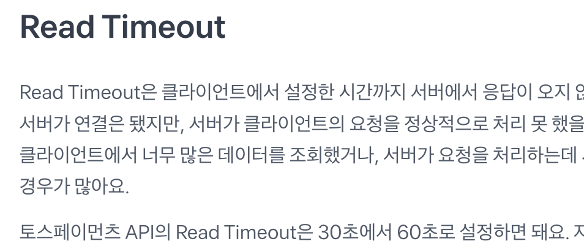

# 2024-06-10
## Connection Timeout 과 Read timeout 은 얼마나 길게 설정하는게 좋을까.

### connection timeout 
connection timeout 은 3way handshake 과정에서 SYN, SYN+ACK 에서 재전송이 일어나면 발생하는 에러입니다. 

통상적으로 TCP Handshake 과정에서 SYN 이 유실되었다고 판단하여 다시 패킷을 보내는 행위를 판단하는 InitRTO 를 1초로 설정합니다. 때문에 첫 번의 실패 후 두 번째 실패까지는 최대 2초 가량의 시간이 소요될 수 있으므로 실패 후 재시도까지 수행하는 것을 고려하였을 때 3초가 적당하다고 생각했습니다. 

### read timeout 

보시는 것 처럼 토스에서는 30-60 을 권장하고 있지만.. 제가 어플리케이션을 사용했던 입장에서는 30초 동안 작업이 수행되기를 기다리는 것은 그리 달가운 기억이 아니었네요 😅

대부분의 성공 요청에서는 5초 이내로 작업이 수행되는 것을 경험적으로 알기에 10초 정도의 여유를 두면 충분히 서버의 장애를 판단할 수 있다고 생각했스빈다. 