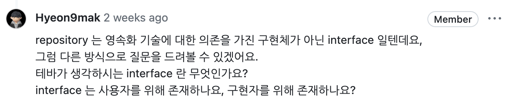

# 2024-06-10
## 레포지토리란 무엇인가? 

> repository 는 영속화 기술에 대한 의존을 가진 구현체가 아닌 interface 일텐데요

계속해서 들었던 의문은 아마도 DDD에서 본래 Repository 가 가지는 의미인 `저장소의 추상화` 와는 다르게 (사실상) 실제 JPA 구현체를 의존하고 있기 때문이라는 생각이 들었어요. 

저장소는 지금처럼 RDBS 를 사용할 수도 있지만 NoSql이 될 수도 있고 아니면 메모리에다만 저장할 수도 있겠죠. 

> 그래서 저장하는 방법은 관심없어! 그냥 저장만 해줘! 

라는 본래 레포지토리의 의미에 부합하려면 DIP 원칙에 따라 레포지토리 인터페이스를 따로 정의하고 JpaRepository가 그것을 구현하는 형태로 변화하는 것이 좋다고 생각했습니다. 

의존성을 JPA를 지운 순수 자바 인터페이스로 변경하니 다른 저장소를 추가할 수 있는 확장성, 가짜객체를 이용한 테스트 용이성 등 장점을 얻을 수 있다는 것을 알게 되었어요! 

이처럼 __사용자가 구현에 의존하지 않고 그 행위만을 기대할 수 있도록 하는 역할의 추상화__ 가 인터페이스라고 생각하고  

1. 다양한 구현자를 사용할 수 있도록 한다는 측면에서는 사용자를,  

2. 무엇을 구현해야하는지 명세서로의 역할을 한다는 관점에서는 구현자를 위해서 존재한다고 할 수 있겠네요. 