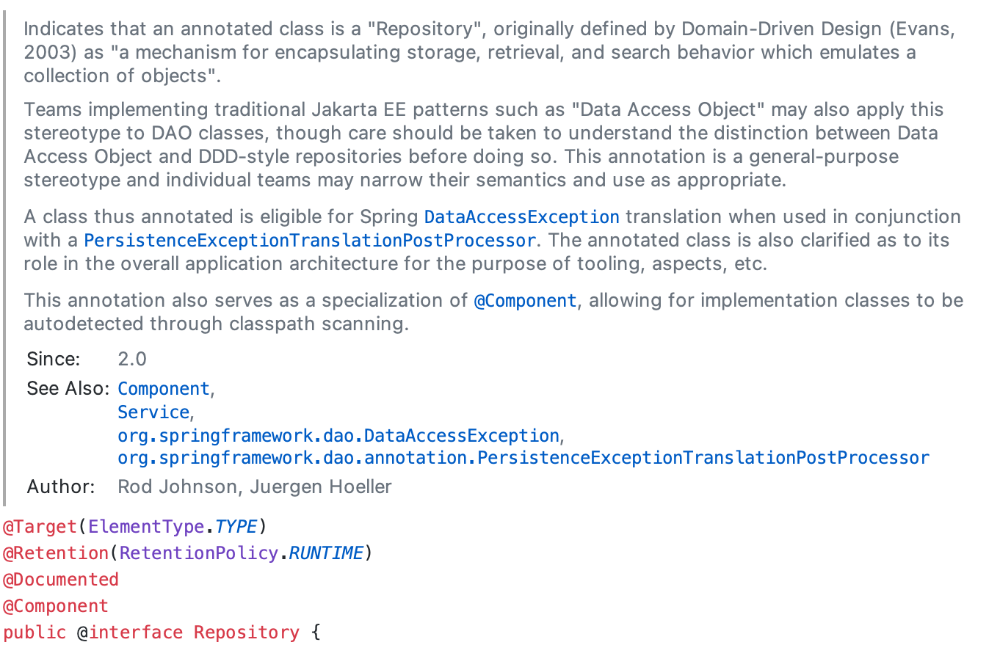
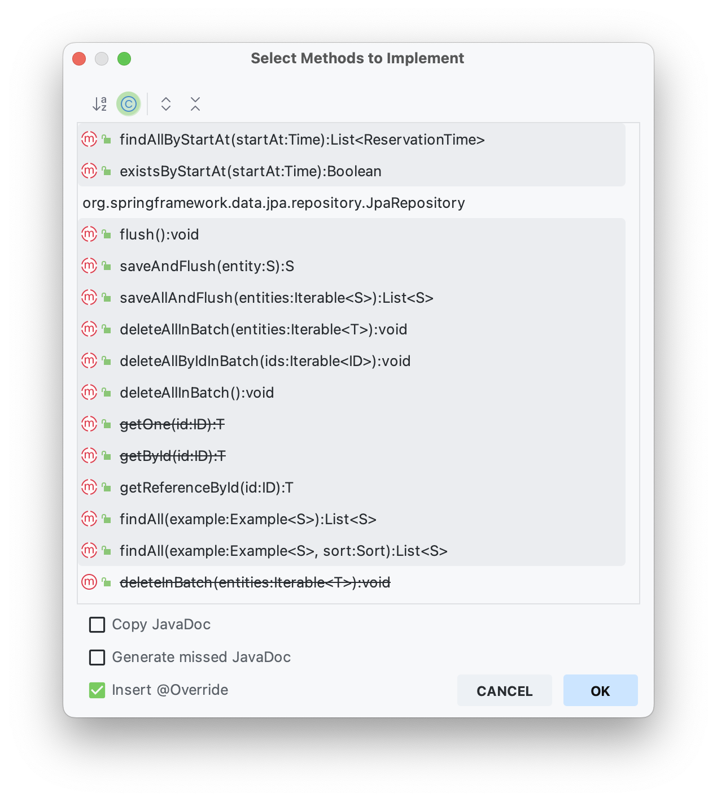

# 2024-05-27

## JpaRepository 는 만능인가? 
### Repository 란? 

Repository 는 DDD에서 파생한 개념으로 저장소 그 자체를 추상화한 개념이다. 우리는 대게 JpaRepostiory 를 습관적으로 사용하지만 DB 벤더사가 MySql만 있는게 아니듯 저장소도 DB 프로그램 뿐 아니라 로컬 저장소, 파일 시스템일 수도 있고 그냥 메모리일 수도 있다.

그럼 우리는 생각해보아야 한다. 많이들 사용하는 레이어드 아키텍쳐의 구조에선   
> Controller -> Service -> Repository   

의 형태를 띄고 있을 것이다. 그리고 Repository 는 아마도 JpaRepository 인터페이스를 참조하여 실제로는 SimpleJpaRepository 를 유일한 구현체로서 사용하고 하는 것이 대부분 스프링 초심자들의 구조일 것이다. 

그럼 우리는 생각해봐야 한다. 과연 **레포지토리는 Jpa 뿐일까?** 

### JpaRepository 가 아니라 Repository 를 참조하라

기획팀에서 NoSql 인 MongoDB 를 사용하기로 했다는 요구사항이 들어왔다고 하자. JPA 는 MongoDB를 지원하지 않는데 우리는 어떻게 해야할까? 

또 복잡한 서비스의 로직이 제대로 동작하는지 궁금해서 FakeDouble 기법을 사용하기로 했다. 그런데 JpaRepository 의 Fake 구현체를 만드려고 보니 

이렇게 많은 불필요한 함수들을 Override 해야 한다. 테스트하기 어려운 구조는 좋은 구조가 아니라는 의견이 많다. 어떻게 하면 좋을까.

이때 다시 Repository의 본질로 돌아가야한다. Repository 는 저장소의 추상화다. 그리고 JpaRepository 는 수많은 Repository 중 하나일 뿐이다. 

즉, 한 단계 더 추상화해야할 시점이 온 것이다.

### Repository Layer 를 구현해보자
작성중

### reference 
* https://velog.io/@ohzzi/JpaRepository-No-Repository-Yes
* https://github.com/kok202/test-code-with-architecture
* https://martinfowler.com/eaaCatalog/repository.html