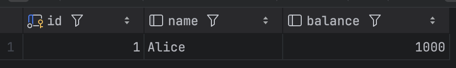
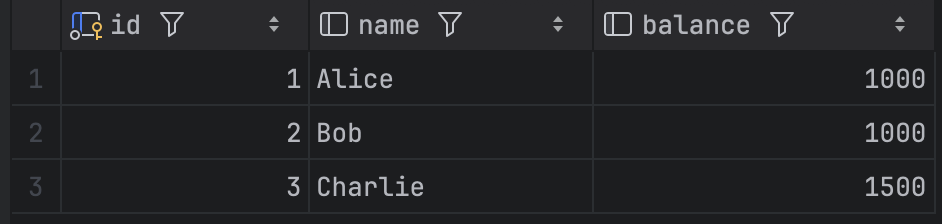

# 트랜잭션 격리 수준을 실제 쿼리로 이해해보자

안녕하세요! 오늘은 데이터베이스 트랜잭션 격리 수준에 대해 실제 쿼리와 함께 알아보려고 합니다.

## 트랜잭션 격리 수준이 뭔가요?

트랜잭션 격리 수준은 여러 트랜잭션이 동시에 실행될 때, 각 트랜잭션이 다른 트랜잭션의 변경사항을 얼마나 "보게" 되는지를 결정하는 설정입니다.

쉽게 말해서, "내가 데이터를 읽고 있는데 다른 사람이 동시에 데이터를 바꾸면 어떻게 될까?"라는 질문에 대한 답이 바로 격리 수준입니다.

## 격리 수준의 종류

### 1. READ UNCOMMITTED (읽기 미커밋)
- **특징**: 다른 트랜잭션의 커밋되지 않은 변경사항도 읽을 수 있음
- **문제점**: Dirty Read 발생 가능
- **성능**: 가장 빠름 (락을 걸지 않음)

### 2. READ COMMITTED (읽기 커밋)
- **특징**: 커밋된 변경사항만 읽을 수 있음
- **문제점**: Non-Repeatable Read 발생 가능
- **성능**: 빠름

### 3. REPEATABLE READ (반복 읽기)
- **특징**: 트랜잭션 내에서 같은 데이터를 여러 번 읽을 때 일관된 결과 보장
- **문제점**: Phantom Read 발생 가능
- **성능**: 보통

### 4. SERIALIZABLE (직렬화)
- **특징**: 가장 엄격한 격리 수준, 트랜잭션들이 순차적으로 실행되는 것처럼 보임
- **문제점**: 거의 없음 (성능 저하만 있음)
- **성능**: 가장 느림

## 각 격리 수준별 문제점들

### Dirty Read (더티 리드)
다른 트랜잭션이 아직 커밋하지 않은 데이터를 읽는 현상입니다.

예시:
- A가 계좌 잔액을 1000원에서 0원으로 변경 (아직 커밋 안 함)
- B가 잔액을 조회 → 0원으로 보임
- A가 롤백 → 실제로는 1000원이었는데 B는 0원을 읽었음

### Non-Repeatable Read (반복 불가능한 읽기)
같은 트랜잭션 내에서 같은 데이터를 두 번 읽을 때 다른 결과가 나오는 현상입니다.

예시:
- A가 첫 번째 조회: 잔액 1000원
- B가 잔액을 2000원으로 변경하고 커밋
- A가 두 번째 조회: 잔액 2000원 → 결과가 달라짐!

### Phantom Read (팬텀 리드)
같은 트랜잭션 내에서 같은 조건으로 조회할 때 새로 추가된 행이 나타나는 현상입니다.

예시:
- A가 "잔액 1000원 이상인 계좌" 조회 → 2개 결과
- B가 잔액 1500원인 새 계좌 추가하고 커밋
- A가 다시 "잔액 1000원 이상인 계좌" 조회 → 3개 결과 → 새 행이 나타남!

## 실제 쿼리로 실험해보자

### 테스트 데이터 준비

```sql
CREATE TABLE accounts (
    id INT PRIMARY KEY,
    name VARCHAR(20),
    balance INT
);

INSERT INTO accounts VALUES (1, 'Alice', 1000);
INSERT INTO accounts VALUES (2, 'Bob', 1000);
```


### Dirty Read 실험

**트랜잭션 1:**
```sql
SET SESSION TRANSACTION ISOLATION LEVEL READ UNCOMMITTED;
START TRANSACTION;
UPDATE accounts SET balance = 0 WHERE id = 1;
-- 커밋하지 않고 대기
```

**트랜잭션 2 (다른 탭에서):**
```sql
SET SESSION TRANSACTION ISOLATION LEVEL READ UNCOMMITTED;
START TRANSACTION;
SELECT * FROM accounts WHERE id = 1;
-- balance가 0으로 보이면 Dirty Read 발생!
```


### Non-Repeatable Read 실험

**트랜잭션 1:**
```sql
SET SESSION TRANSACTION ISOLATION LEVEL READ COMMITTED;
START TRANSACTION;
SELECT * FROM accounts WHERE id = 1; -- 첫 번째 조회: balance = 1000
```



**트랜잭션 2:**
```sql
SET SESSION TRANSACTION ISOLATION LEVEL READ COMMITTED;
START TRANSACTION;
UPDATE accounts SET balance = 2000 WHERE id = 1;
COMMIT;
```

**트랜잭션 1에서 다시 조회:**
```sql
SELECT * FROM accounts WHERE id = 1; -- 두 번째 조회: balance = 2000
-- 결과가 달라지면 Non-Repeatable Read 발생!
```


### Phantom Read 실험

**트랜잭션 1:**
```sql
SET SESSION TRANSACTION ISOLATION LEVEL REPEATABLE READ;
START TRANSACTION;
SELECT * FROM accounts WHERE balance >= 1000; -- 첫 번째 조회: 2개 결과
```


**트랜잭션 2:**
```sql
SET SESSION TRANSACTION ISOLATION LEVEL READ COMMITTED;
START TRANSACTION;
INSERT INTO accounts (id, name, balance) VALUES (3, 'Charlie', 1500);
COMMIT;
```

**트랜잭션 1에서 다시 조회:**
```sql
SELECT * FROM accounts WHERE balance >= 1000; -- 두 번째 조회
-- 결과가 3개가 되면 Phantom Read 발생!
```



## 어떤 격리 수준을 사용해야 할까?

### READ UNCOMMITTED
- **사용 시기**: 정확성보다 성능이 중요한 경우
- **예시**: 통계 데이터, 분석용 데이터

### READ COMMITTED
- **사용 시기**: 대부분의 일반적인 애플리케이션
- **예시**: 웹 애플리케이션, 일반적인 비즈니스 로직

### REPEATABLE READ
- **사용 시기**: 데이터 일관성이 중요한 경우
- **예시**: 금융 시스템, 재고 관리

### SERIALIZABLE
- **사용 시기**: 가장 엄격한 일관성이 필요한 경우
- **예시**: 은행 시스템, 결제 시스템

## 마무리

트랜잭션 격리 수준은 성능과 일관성 사이의 트레이드오프입니다. 

- 격리 수준이 낮을수록 → 성능은 좋지만 일관성 문제 발생
- 격리 수준이 높을수록 → 일관성은 좋지만 성능 저하

실제 프로젝트에서는 **READ COMMITTED**를 기본으로 사용하고, 특별한 요구사항이 있을 때만 다른 격리 수준을 고려하는 것이 좋습니다.

오늘 실험해본 내용들이 도움이 되었기를 바랍니다! 😊
