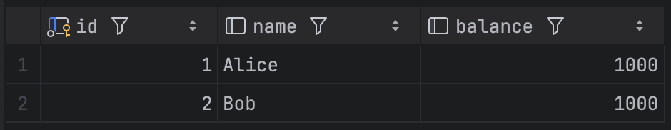
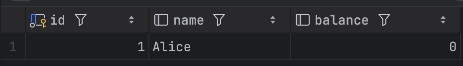
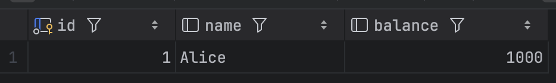
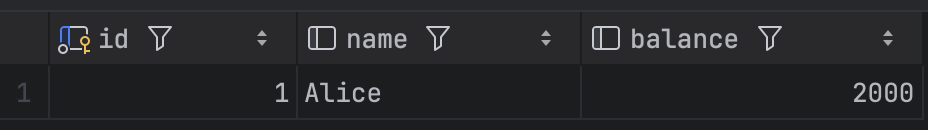
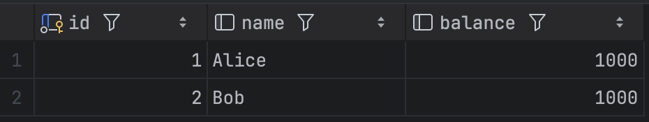
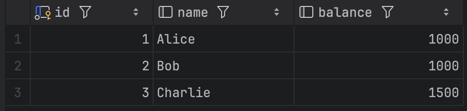

# 트랜잭션 격리 수준을 실제 쿼리로 이해하기 

## 트랜잭션 격리 수준 
- READ UNCOMMITTED : 다른 트랜잭션의 커밋되지 않은 사항을 읽을 수 있다. (Dirty Read 발생 가능)
- READ COMMITTED : 다른 트랜잭션의 커밋된 사항만 읽을 수 있다. (Non-Repeatable Read 발생 가능)
- REPEATABLE READ : 트랜잭션 내에서 동일한 데이터를 여러 번 읽을 때 일관된 결과를 보장한다. (Phantom Read 발생 가능)
- SERIALIZABLE : 가장 엄격한 격리 수준으로, 트랜잭션들이 순차적으로 실행되는 것처럼 보이게 한다.

## 트랜잭션 격리 수준별 문제점들
- Dirty Read: 다른 트랜잭션의 커밋되지 않은 변경 사항을 읽는 현상
- Non-Repeatable Read: 다른 트랜잭션의 커밋된 변경사항으로 인해 하나의 트랜잭션에서 두번의 읽기가 서로 다른 결과가 나오는 현상
- Phantom Read: 다른 트랜잭션의 Insert로 인해 하나의 트랜잭션에서 두번의 읽기에 또 다른 로우가 추가되는 현상. 

## 실제 쿼리로 실험하기

### 예시 데이터 생성하기

```sql
CREATE TABLE accounts (
    id INT PRIMARY KEY,
    name VARCHAR(20),
    balance INT
);

INSERT INTO isolation_test.accounts VALUES (1, 'Alice', 1000);
INSERT INTO isolation_test.accounts VALUES (2, 'Bob', 1000);
```


### Dirty Read
- READ Uncommitted 에서 발생 

```sql
-- tx1
USE isolation_test;

SET SESSION TRANSACTION ISOLATION LEVEL READ UNCOMMITTED;
START TRANSACTION;

UPDATE accounts SET balance = 0 WHERE id = 1;

-- 이 상태로 커밋 없이 대기

-- tx2 다른 탭에서 진행
USE isolation_test;

SET SESSION TRANSACTION ISOLATION LEVEL READ UNCOMMITTED;
START TRANSACTION;

SELECT * FROM accounts WHERE id = 1;

-- balance가 0으로 보이면 Dirty Read 발생한 것!
-- 원래는 1000이었음
```



### Non-repeatable Read

```sql
-- tx1
USE isolation_test;

SET SESSION TRANSACTION ISOLATION LEVEL READ COMMITTED;
START TRANSACTION;

-- 첫 번째 조회
SELECT * FROM accounts WHERE id = 1;
-- 👆 balance = 1000 이라고 가정
```



```sql
-- tx2
USE isolation_test;

SET SESSION TRANSACTION ISOLATION LEVEL READ COMMITTED;
START TRANSACTION;

UPDATE accounts SET balance = 2000 WHERE id = 1;
COMMIT;


SELECT * FROM accounts WHERE id = 1;
-- 👇 결과가 2000이면 Non-Repeatable Read 발생

```




### Phantom Read

```sql
-- tx1
USE isolation_test;

SET SESSION TRANSACTION ISOLATION LEVEL REPEATABLE READ;
START TRANSACTION;

-- 첫 번째 SELECT
SELECT * FROM accounts WHERE balance >= 1000;
-- 👆 현재 Alice, Bob 2명 예상
```



```sql
USE isolation_test;

SET SESSION TRANSACTION ISOLATION LEVEL READ COMMITTED;
START TRANSACTION;

INSERT INTO accounts (id, name, balance) VALUES (3, 'Charlie', 1500);
COMMIT;

-- 커밋후 같은 조건으로 다시 조회
SELECT * FROM accounts WHERE balance >= 1000;
-- 결과가 그대로 2명 → Phantom Read 방지됨
-- 결과가 3명 (Charlie 추가됨) → Phantom Read 발생

```



